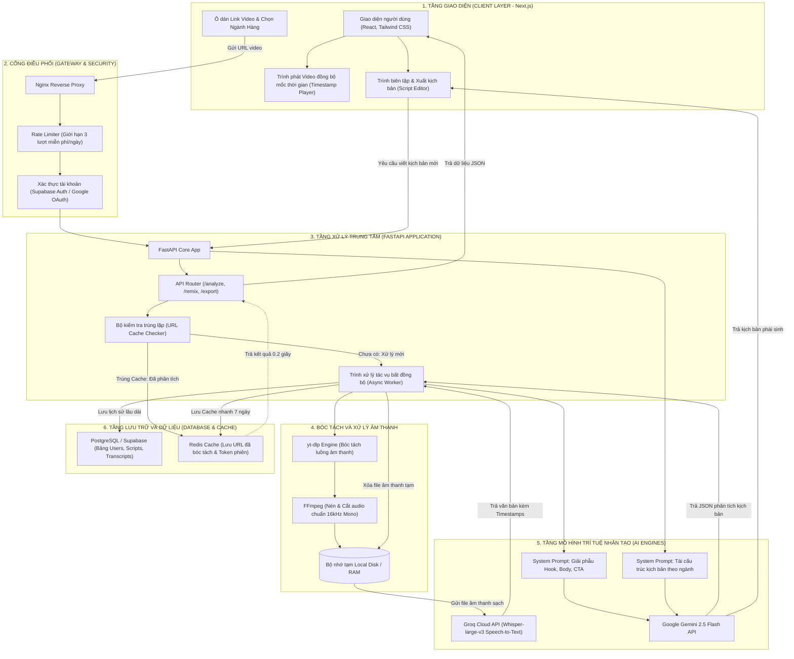

# KIẾN TRÚC HỆ THỐNG (SYSTEM ARCHITECTURE) - VIRAL SCRIPT AI

Tài liệu này đặc tả toàn bộ kiến trúc kỹ thuật của hệ thống Giải Phẫu & Tái Cấu Trúc Kịch Bản Video Triệu View.

---

## BÓC TÁCH CÁC THÀNH PHẦN

1. **Frontend (Next.js 14)**: Trình phát `react-player` kết nối thời gian thực với mốc thời gian câu thoại (Click-to-Sync).
2. **Audio Ingestion (`yt-dlp` + `ffmpeg`)**: Chỉ trích xuất stream âm thanh, chuyển đổi sang chuẩn 16.000 Hz Mono, tự động xóa file tạm sau khi nhận diện xong.
3. **Speech-to-Text (Groq Whisper-large-v3)**: Tốc độ xử lý 1-2 giây cho video 60 giây, trả về mảng segments với thời điểm bắt đầu và kết thúc của từng câu.
4. **LLM Engine (Gemini 2.5 Flash)**: Nhận lời thoại có mốc thời gian, bóc tách cấu trúc tâm lý Hook, Body, CTA theo JSON Schema nghiêm ngặt.
5. **Database & Auth (Supabase PostgreSQL)**: Bảo mật khóa dòng RLS, mã hóa mật khẩu bcrypt, hỗ trợ Google OAuth 2.0.
